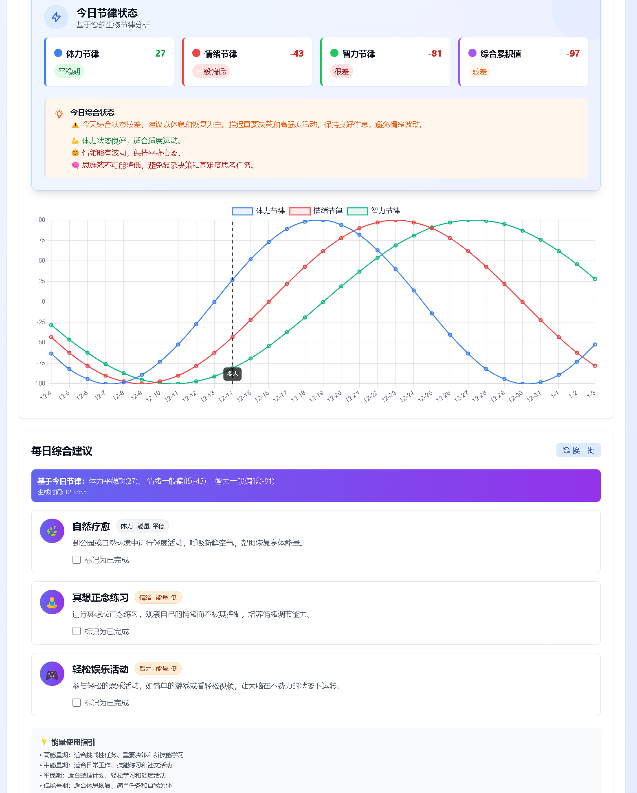
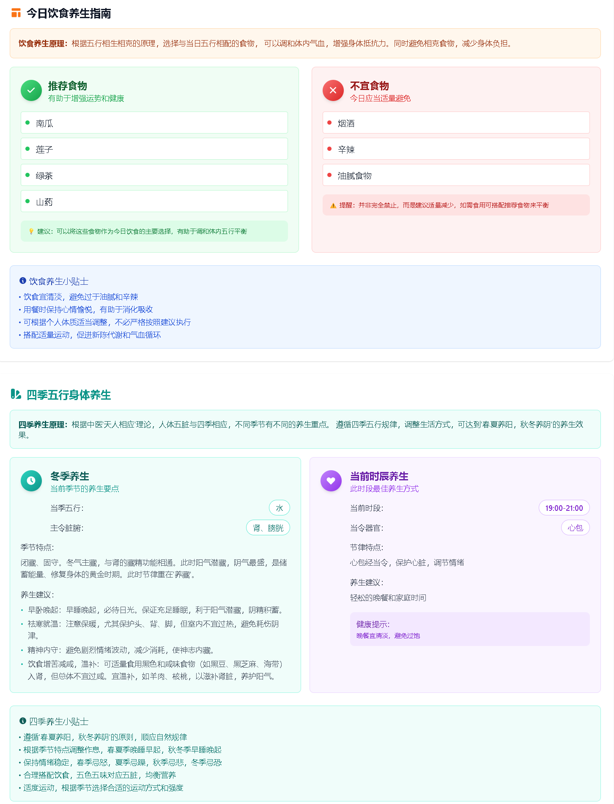

# 🌟 生物节律应用 - Nice Today

一个基于生物节律理论的综合应用，提供个性化的生理状态分析和穿衣饮食建议。

## 📋 项目简介

Nice Today 是一个现代化的生物节律应用，通过分析用户的生物节律数据，提供个性化的健康建议和生活指导。本项目采用 Electron 架构，提供桌面应用程序体验，支持跨平台运行。

## 😊 项目截图





## 🏗️ 技术栈

### 前端
- **React 18** - 现代化前端框架
- **Tailwind CSS** - 原子化CSS框架
- **Axios** - HTTP客户端

### 后端
- **Electron** - 跨平台桌面应用程序框架
- **JavaScript** - 纯JavaScript后端实现
- **Node.js** - JavaScript运行时

### 核心服务
- **生物节律计算服务** - 精确计算用户的身体、情绪和智力节律
- **穿衣指南服务** - 基于季节、五行理论和特殊日期的个性化建议
- **玛雅历法服务** - 玛雅文化相关的历法计算

## 📁 项目结构

```
nice_today/
├── frontend/                 # React前端应用
│   ├── src/                # 源代码
│   │   ├── components/     # React组件
│   │   ├── assets/         # 静态资源
│   │   └── index.js        # 入口文件
│   ├── public/             # 公共资源
│   ├── package.json        # 前端依赖配置
│   └── webpack.config.js   # 前端构建配置
├── backend/                # JavaScript后端服务
│   ├── biorhythm.js       # 生物节律计算核心
│   ├── maya.js            # 玛雅历法计算
│   ├── dress.js           # 穿衣建议核心逻辑
│   └── config/            # 配置文件
├── electron/               # Electron主进程和渲染进程
│   ├── main.js            # 主进程入口
│   ├── preload.js         # 预加载脚本
│   ├── menu.js            # 应用菜单
│   ├── services/          # Electron后端服务
│   │   ├── biorhythmService.js     # 生物节律服务
│   │   ├── dressService.js         # 穿衣指南服务
│   │   └── mayaService.js          # 玛雅历法服务
│   └── package.json       # Electron依赖配置
├── scripts/               # 构建和工具脚本
├── docs/                  # 项目文档
├── package.json           # 项目根配置
├── build.js              # 应用构建脚本
└── LICENSE               # 开源许可证
```

## 🚀 快速开始

### 系统要求
- Node.js 16+ 
- npm 7+
- Electron 支持的操作系统（Windows 10+, macOS 10.14+, Ubuntu 18.04+）

### 方式一：开发模式运行（推荐）

```bash
# 克隆项目
git clone [项目地址]
cd nice_today

# 安装依赖
npm install

# 启动开发服务器
npm start
```

### 方式二：构建应用程序

```bash
# 克隆项目
git clone [项目地址]
cd nice_today

# 安装依赖
npm install

# 构建前端资源
npm run build

# 启动Electron应用
npm run electron
```

### 方式三：打包可执行文件

```bash
# 克隆项目
git clone [项目地址]
cd nice_today

# 安装依赖
npm install

# 打包应用程序
npm run build-win    # Windows平台
npm run build-mac    # macOS平台
npm run build-linux  # Linux平台
```

### 快速测试脚本

```bash
# 测试生物节律功能
node integration_test.js

# 构建和测试完整流程
node build_and_test.js
```

## 🔧 开发指南

### 项目脚本说明

- `build.js` - 主构建脚本，负责构建前端资源和启动Electron应用
- `build_and_test.js` - 构建并运行集成测试
- `integration_test.js` - 集成测试脚本，验证各模块功能
- `debug_resources.js` - 调试资源加载问题
- `fix_frontend_components.js` - 修复前端组件问题
- `create_real_icons.js` - 创建应用图标
- `final_build.js` - 最终构建脚本

### 前端开发

```bash
# 进入前端目录
cd frontend

# 安装依赖
npm install

# 启动开发服务器（热重载）
npm start

# 构建生产版本
npm run build
```

### 后端服务开发

```bash
# 进入后端目录
cd electron/services

# 修改服务后重新启动应用
npm start
```

### 调试指南

1. **开启调试模式**
   ```bash
   # 开启详细日志
   DEBUG=true npm start
   ```

2. **查看日志**
   - 前端日志：浏览器控制台
   - 后端日志：Electron开发者工具控制台

3. **常见问题排查**
   - 检查端口占用：`netstat -ano | findstr :3000`
   - 清理缓存：`npm run clean`
   - 重新安装依赖：`rm -rf node_modules && npm install`

## 📊 主要功能

### 1. 生物节律分析
- 精确计算用户的身体、情绪和智力节律周期
- 可视化展示节律变化趋势图表
- 提供每日节律状态详细报告
- 支持自定义日期范围查询和分析

### 2. 个性化穿衣建议
- **季节性建议**：根据当前季节推荐适合的服装
- **五行理论**：结合中国传统五行理论提供穿衣指导
- **特殊日期**：针对特殊节日和场合的着装建议
- **节律状态适配**：根据生物节律状态调整穿衣建议

### 3. 饮食推荐系统
- **多样化选择**：提供丰富的每日饮食建议
- **原子化设计**：确保每日计算结果的唯一性和一致性
- **营养均衡**：基于身体状况提供科学营养建议
- **季节性食材**：推荐适合当季的健康食材

### 4. 玛雅历法服务
- 玛雅文化相关的历法计算
- 传统智慧与现代生活的结合
- 提供独特的文化体验视角

### 5. 日期精准计算
- 本地时区支持（默认UTC+8）
- 避免时区转换导致的日期偏差
- 用户输入日期的精确处理
- 独立于当前时间的纯数学计算

## 🔧 配置说明

### 应用配置
主要配置文件位于 `electron/config/` 目录：

```json
{
  "biorhythm": {
    "physical_cycle": 23,
    "emotional_cycle": 28,
    "intellectual_cycle": 33
  },
  "dress": {
    "seasons": ["spring", "summer", "autumn", "winter"],
    "elements": ["木", "火", "土", "金", "水"]
  }
}
```

### 前端配置
前端配置文件位于 `frontend/src/config/` 目录：

```javascript
export const API_CONFIG = {
  timeout: 5000,
  retryAttempts: 3,
  // 其他配置项
};
```

### 自定义配置
编辑相关配置文件可调整：
- 生物节律周期参数
- 穿衣建议算法权重
- 饮食推荐策略
- 界面主题和样式

## 🐛 常见问题

### 应用启动失败
1. 检查Node.js版本是否符合要求
2. 清理node_modules并重新安装依赖
3. 检查是否有其他进程占用了所需端口

### 日期计算错误
1. 确认系统时区设置正确
2. 检查日期输入格式是否符合要求
3. 查看控制台是否有相关错误信息

### 穿衣指南无结果
1. 检查配置文件是否完整
2. 确认当前日期和季节参数是否正确
3. 查看服务日志确认计算过程是否正常

### 界面显示异常
1. 尝试清除应用缓存
2. 检查浏览器控制台的错误信息
3. 确认前端资源是否正确加载

## 🚀 发布Release版本到GitHub

本项目提供了详细的发布指南和自动化脚本，请参考 [RELEASE_GUIDE.md](./RELEASE_GUIDE.md) 获取完整的发布流程说明。

### 快速发布

#### 方式一：使用自动化脚本（推荐）
```bash
# 发布补丁版本 (1.0.0 → 1.0.1)
npm run release

# 发布次要版本 (1.0.0 → 1.1.0)
npm run release:minor

# 发布主要版本 (1.0.0 → 2.0.0)
npm run release:major

# 发布指定版本
npm run release 1.2.3
```

#### 方式二：手动发布
1. 运行测试和构建
   ```bash
   npm test
   npm run build
   ```

2. 创建Git标签
   ```bash
   git tag -a v1.0.0 -m "发布版本 1.0.0"
   git push origin v1.0.0
   ```

3. 在GitHub创建Release并上传构建文件

### 发布前检查清单
- [ ] 所有测试通过
- [ ] 版本号已更新
- [ ] 构建文件可正常运行
- [ ] 更新日志已编写
- [ ] 发布说明已准备

### Release最佳实践
1. **语义化版本控制**：遵循 `主版本号.次版本号.修订号` 格式
2. **详细的发布说明**：包含新功能、改进和修复的问题
3. **添加附件**：提供各平台的可执行文件
4. **更新CHANGELOG**：维护详细的变更记录
5. **标签管理**：为每个重要版本创建对应的Git标签

## 📞 技术支持

### 文档资源
- [快速开始指南](QUICK_START.md)
- [构建说明](BUILD_INSTRUCTIONS.md)
- [验证步骤](VERIFICATION_STEPS.md)
- [JavaScript实现说明](PURE_JAVASCRIPT_IMPLEMENTATION.md)

### 开发团队
如有问题，请联系开发团队或提交Issue。

## 📄 许可证

本项目采用MIT许可证，详见LICENSE文件。

## 🔄 版本历史

### v1.0.0 (最新)
- 初始版本发布
- 完整的生物节律计算功能
- 个性化穿衣建议系统
- 饮食推荐功能
- 玛雅历法服务
- 精确的日期计算和时区处理

## 🤝 贡献指南

1. Fork 本仓库
2. 创建特性分支 (`git checkout -b feature/AmazingFeature`)
3. 提交更改 (`git commit -m 'Add some AmazingFeature'`)
4. 推送到分支 (`git push origin feature/AmazingFeature`)
5. 提交Pull Request

## 📊 项目统计

- **开发语言**: JavaScript, React
- **框架**: Electron
- **平台支持**: Windows, macOS（后续支持）
- **开发时间**: 2024-2025
- **项目类型**: 桌面应用程序